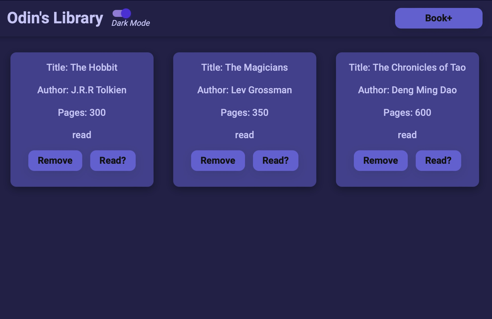

## Library

[Try it out for yourself!](https://gavinberetvas.github.io/library-odinproject/)   :point_left:

## Summary

This is a basic javascript library for the [Odin Project](https://www.theodinproject.com/lessons/node-path-javascript-library). The library is an array which can be populated with book objects. The code then displays them in a simple library. When books are deleted, both the display and the objects in the array are modified. 

I am particularly pleased with the dark/light mode switch. It works by swapping the values of CSS variables; changing the identity of a "data-theme" from light to dark.

>[data-theme="dark"] {
  --background-color: #212047;
  --secondary-color: #c5c3f8;
  --button-color: #635fd6;
  --card-color: #42408f; }

I learned this and more through reading [Ananya Neogi's excellent blog post](https://dev.to/ananyaneogi/create-a-dark-light-mode-switch-with-css-variables-34l8). 

### Technologies

* HTML5
* CSS3
* Vanilla JS/ES6

### Supporting Tools

* ESLint
* Git/GitHub
* Visual Studio Code

## Credits
* Thanks to [Andreas Storm](https://github.com/andreasstorm) for the switch style.
* Thanks to Ananya Neogi for the [dark mode tutorial](https://dev.to/ananyaneogi/create-a-dark-light-mode-switch-with-css-variables-34l8).

## License

* Copyright © 2023 Gavin Beretvas
